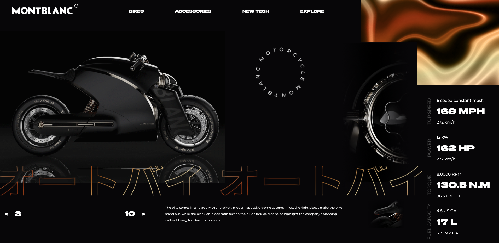

# Montblanc_integration

Integration work based on Figma template.
Responsive is not created for yet.

## Technologies used

 

## Result

You can try it here : [link to the website](https://quentinroggy.github.io/Montblanc_integration/)

## Template

Figma template provided by [@Benjamin_Code](https://www.youtube.com/c/BenjaminCode/featured)

[Lien vers la maquette](https://www.figma.com/file/TkRfqae1HAzJOTYRRNtq79/Montblanc---Motorcycle-website-concept-design?node-id=0%3A1)
